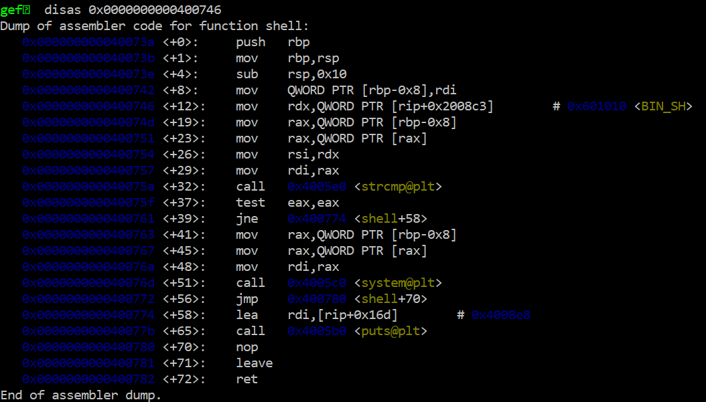

# Free Shell

## DESCRIPTION
Want a shell? Just give it a call! You'll need to provide the command though.

Interact with the service at:
`chals.cyberthon22t.ctf.sg:20401`

Concept(s) Required:
- [Buffer Overflow to overwrite RIP](https://guyinatuxedo.github.io/05-bof_callfunction/csaw18_getit/index.html)
- [Using Return Oriented Programming to pass x64 parameters](https://www.youtube.com/watch?v=abEOdicWhNo)

Note: once you get a shell, the flag.txt can be found in the user's home directory.

Author: niktay

## FILES
[free_shell](./free_shell)
[main.c](./main.c)

## SOLUTION
Offset of rip found by searching for rbp in gdb. 

Clearly stated that this is a ROP challenge. Reading the source code, we can clearly see a `shell` function.

```python
void shell(char **cmd)
{
    if (!strcmp(*cmd, BIN_SH))
    {
        system(*cmd);
    }
    else
    {
        puts("Try calling system(\"/bin/sh\").");
    }
}
```

This function is not called in main(), so we have to call it ourselves. From gdb, the shell() address is `0x000000000040073a`. 

(You can find functions in gdb with `info functions`, and disassemble each function with `disas <function_name>`)

The shell function takes a pointer to a pointer as a parameter, then takes the pointed-to-pointer to compare against `BIN_SH`. Essentially, we need to ensure that the parameter is set to the **address of BIN_SH**.

Then the shell function will make a syscall to `BIN_SH`, essentially opening a shell. 

The address to `BIN_SH` is `0x0000000000601010`, which can be seen from the disassembled shell(). 



As you can see, before the `mov    rdx,QWORD PTR [rip+0x2008c3]        # 0x601010 <BIN_SH>` line, the value in rdi is moved somewhere. Since this is immediately after the function is declared, and just before the `strcmp` function begins, it means that `rdi` is taken as the parameter to be compared later. Therefore we need to `pop rdi` to change the parameter. 

Using ROPgadget, `ROPgadget --binary=free_shell | grep 'pop rdi'` to find gadgets to pop rdi. 

There's one at `0x4008b3`. To use this, call the address of the pop gadget and send the hex of the value you would like to change it to. 

Now we just need to call the gadget before shell(), with our payload looking like:

`rop = offset + ret + poprdi + bin_sh + shell`

Full script at [shell.py](./shell.py)

`CTFSG{f1r5t_5t3p_t0_r0pp1ng}`
